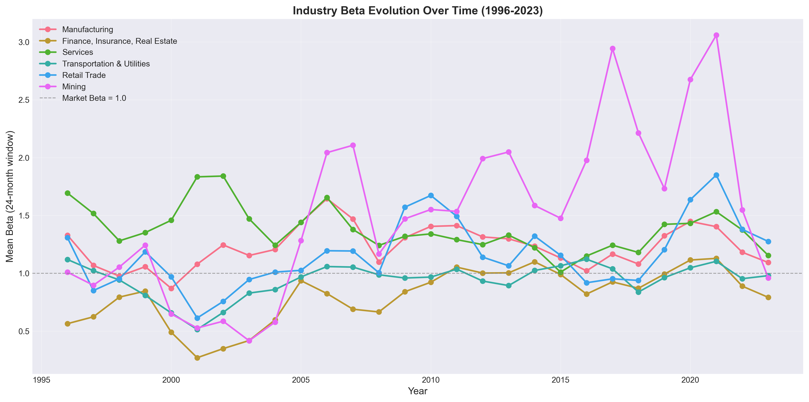
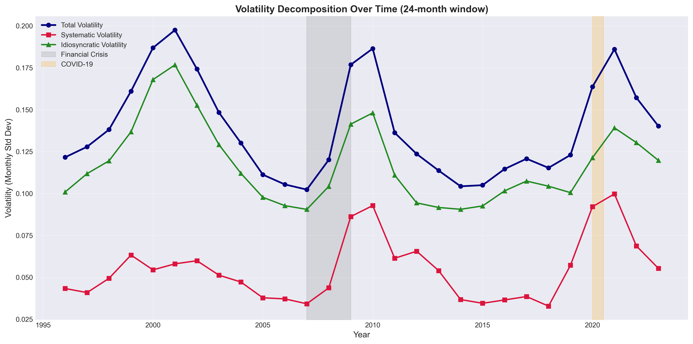
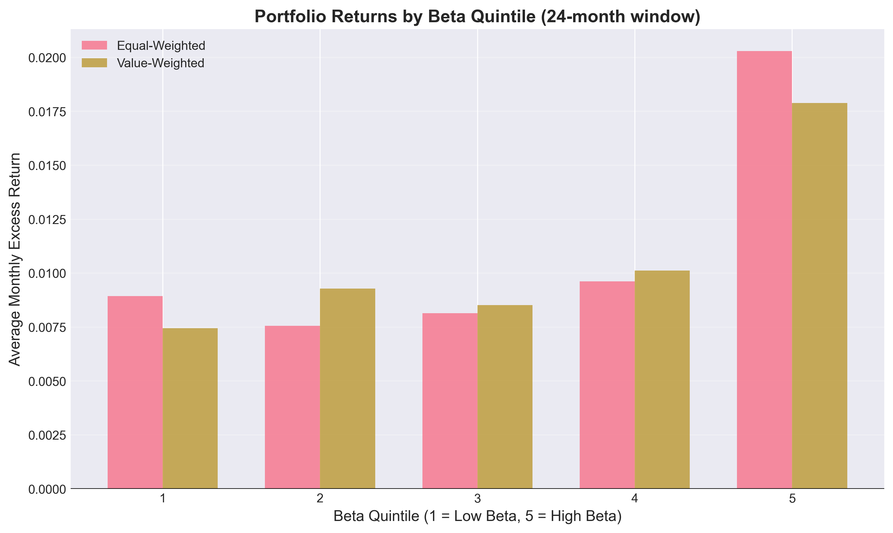
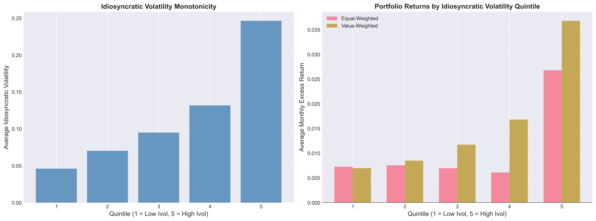
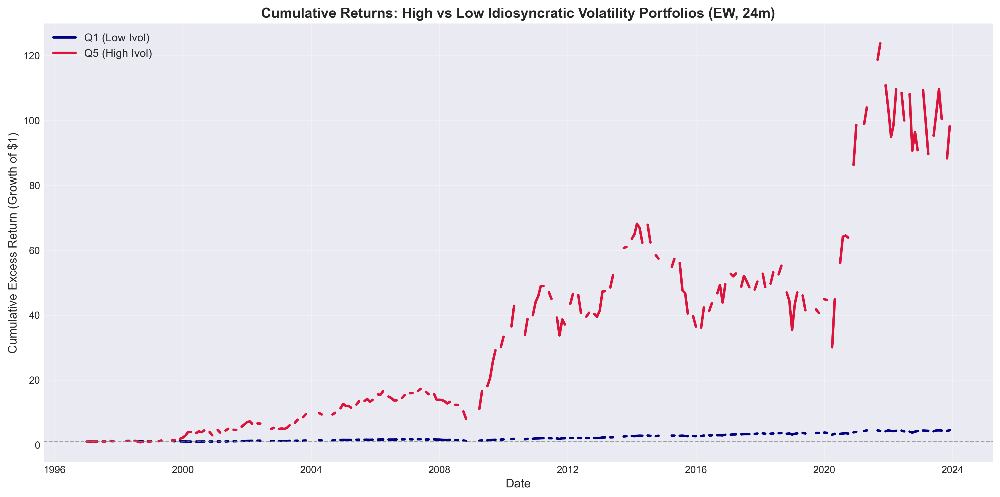

# CAPM Beta & Volatility Decomposition: Portfolio Analysis Across Market Conditions

**Author:** Emma Nagy  
**Date:** September 2026 
**Data Source:** CRSP Monthly Stock File (1996-2023)

[](https://nbviewer.org/github/enagy827/CAPM-beta-and-volatility-decomposition/blob/main/CAPM_Beta_Volatility_Analysis.ipynb)
[](report/Portfolio_Project_4__CAPM_Beta_and_Volatility_Decomposition.pdf)

---

## 📊 Project Overview

This project examines the relationship between systematic risk (beta), idiosyncratic volatility, and cross-sectional stock returns using 28 years of U.S. equity data. The analysis estimates CAPM betas across multiple rolling windows (12, 24, and 36 months), decomposes total volatility into systematic and idiosyncratic components, and constructs quintile portfolios to test risk-return relationships.

Spanning 1996-2023, the sample encompasses multiple market regimes including the dot-com bubble, 2008 financial crisis, and COVID-19 pandemic, providing robust evidence for risk-return dynamics across varying market conditions.

## 🔍 Key Findings

1. **CAPM Validation**: High-beta portfolios earn **13.7% higher annual returns** (equal-weighted) than low-beta portfolios, confirming the positive systematic risk-return relationship predicted by CAPM theory.

2. **Idiosyncratic Volatility Anomaly**: The highest idiosyncratic volatility quintile earns **23.4% higher annual returns** (equal-weighted) and **35.8% higher returns** (value-weighted) compared to the lowest quintile—a striking result that challenges standard asset pricing theory since firm-specific risk should be diversifiable.

3. **Volatility Dominance**: Idiosyncratic volatility (11.82% monthly) accounts for **more than twice** the magnitude of systematic volatility (5.48%), demonstrating that firm-specific risk dominates total stock volatility. This underscores the critical importance of diversification.

4. **Non-Linear Risk Premium**: The idiosyncratic volatility premium exhibits extreme non-linearity—portfolios Q1-Q4 earn similar returns, but Q5 (highest volatility) dramatically outperforms, suggesting a threshold effect where only the most extreme firm-specific risk earns exceptional returns.

5. **Path Dependency Matters**: While high-idiosyncratic-volatility portfolios deliver exceptional long-run returns (120x over 28 years vs. 5x for low-volatility portfolios), the path is extremely volatile with severe drawdowns exceeding 50% during crises. This illustrates the fundamental tension between high average returns and path-dependent risk.

---

## 📁 Repository Contents

```
CAPM-beta-and-volatility-decomposition/
├── CAPM_Beta_Volatility_Analysis.ipynb          # Complete Jupyter notebook with analysis
├── outputs/
│   ├── beta_trends_by_industry.png              # Industry beta evolution (1996-2023)
│   ├── volatility_decomposition_time_series.png # Systematic vs idiosyncratic volatility
│   ├── beta_quintile_returns.png                # Returns by beta quintile (EW vs VW)
│   ├── ivol_quintile_analysis.png               # Idiosyncratic volatility analysis (2-panel)
│   └── cumulative_returns_ivol_Q5_vs_Q1.png     # Long-run cumulative returns
├── report/
│   └── Portfolio_Project_4__CAPM_Beta_and_Volatility_Decomposition.pdf  # Technical report
├── requirements.txt                             # Python dependencies
└── README.md                                    # This file
```

---

## 📈 Visualizations

### 1. Industry Beta Evolution

*Mean beta estimates for six major industries from 1996-2023 using 24-month rolling windows. Notable spikes occur during the 2008 financial crisis and 2020 COVID-19 pandemic, reflecting increased market correlation during stressed conditions.*

### 2. Volatility Decomposition Over Time

*Total, systematic, and idiosyncratic volatility components over the sample period. Idiosyncratic volatility (green) consistently dominates systematic volatility (red), even during crisis periods. Shaded regions indicate major market stress events.*

### 3. Beta Quintile Portfolio Returns

*Average monthly excess returns by beta quintile. High-beta portfolios (Q5) earn 1.14% higher monthly returns (equal-weighted) than low-beta portfolios (Q1), translating to approximately 13.7% annually. The pattern holds across both equal-weighted and value-weighted schemes.*

### 4. Idiosyncratic Volatility Analysis

*Left panel: Average idiosyncratic volatility at portfolio formation, confirming monotonic sorting. Right panel: Returns by quintile showing extreme non-linearity—Q1-Q4 earn similar returns, but Q5 dramatically outperforms with 2.68% monthly (EW) and 3.68% monthly (VW) returns.*

### 5. Cumulative Returns: High vs Low Volatility

*Growth of $1 invested in high (Q5) vs. low (Q1) idiosyncratic volatility portfolios. Q5 achieves 120x growth over 28 years but with extreme volatility and severe drawdowns during crises. Q1 shows steady 5x growth with minimal turbulence, illustrating the path-dependency tradeoff.*

---

## 🚀 How to Run This Analysis

### View Online (No Installation Required)

**[View the interactive notebook on nbviewer →](https://nbviewer.org/github/enagy827/CAPM-beta-and-volatility-decomposition/blob/main/CAPM_Beta_Volatility_Analysis.ipynb)**

### Run Locally

#### Prerequisites
- Python 3.8 or higher
- Jupyter Notebook or JupyterLab
- CRSP data access (MSF_1996_2023.csv and RF_monthly.csv required)

#### Option 1: Using Git

```bash
# Clone the repository
git clone https://github.com/enagy827/CAPM-beta-and-volatility-decomposition.git
cd CAPM-beta-and-volatility-decomposition

# Install dependencies
pip install -r requirements.txt

# Add your data files to the root directory:
# - MSF_1996_2023.csv (CRSP Monthly Stock File)
# - RF_monthly.csv (Risk-free rates)

# Launch Jupyter
jupyter notebook

# Open CAPM_Beta_Volatility_Analysis.ipynb and run all cells
```

#### Option 2: Download ZIP

1. Click the green **"Code"** button at the top of this repository
2. Select **"Download ZIP"**
3. Extract the files to your desired location
4. Add required data files (MSF_1996_2023.csv, RF_monthly.csv) to the root directory
5. Open terminal/command prompt and navigate to the extracted folder
6. Install dependencies: `pip install -r requirements.txt`
7. Launch Jupyter: `jupyter notebook`
8. Open `CAPM_Beta_Volatility_Analysis.ipynb` and run the cells

---

## 🛠️ Methodology

### Sample Construction
- **Data source**: CRSP Monthly Stock File (1996-2023, 28 years)
- **Sampling strategy**: 10 firms randomly selected per industry per year to manage computational complexity while maintaining cross-sectional representation
- **Final sample**: 1,997 unique stocks, 362,667 stock-month observations
- **Industry classification**: 10 industries based on SIC codes (Agriculture, Mining, Construction, Manufacturing, Transportation & Utilities, Wholesale Trade, Retail Trade, Finance, Services, Public Administration)

### Beta Estimation
**CAPM single-factor model:**
```
r_{i,t} = α_i + β_i · MKT_t + ε_{i,t}
```
where `r_{i,t}` is the excess return of stock `i` (stock return minus risk-free rate) and `MKT_t` is the market excess return.

- **Rolling window regressions**: 12, 24, and 36-month windows
- **Estimation approach**: For each stock-month, beta estimated using preceding window period
- **Captures**: Time-varying systematic risk with sufficient observations for reliable estimation

### Volatility Decomposition
**Total volatility decomposed into components:**
```
√Var(R_{i,t}) = β_{i,t} √Var(R_{m,t}) + √Var(ε_{i,t})
```

- **Total Volatility**: Standard deviation of stock excess returns
- **Systematic Volatility**: |β| × market return standard deviation
- **Idiosyncratic Volatility**: Standard deviation of regression residuals (firm-specific shocks)

### Portfolio Construction
**Quintile sorting methodology:**
- Each month, stocks sorted into five quintiles based on beta or idiosyncratic volatility
- **Q1** = lowest risk, **Q5** = highest risk
- Portfolio returns computed using two weighting schemes:
  - **Equal-weighted (EW)**: Each stock receives weight 1/N
  - **Value-weighted (VW)**: Stocks weighted by market capitalization
- **High-minus-low (HML) spread**: Q5 - Q1 measures risk premium

---

## 💻 Technologies Used

- **Python**: Core programming language
- **Pandas**: Data manipulation and time series analysis
- **NumPy**: Numerical computations and statistical operations
- **Scikit-learn**: Linear regression for beta estimation
- **Matplotlib & Seaborn**: Publication-quality visualizations
- **Jupyter**: Reproducible analysis environment
- **LaTeX**: Professional technical report generation

---

## 🎯 Key Insights

### CAPM Works—But It's Not the Whole Story

**What the data confirms:**
- High-beta stocks earn 13-14% higher annual returns, validating CAPM's core prediction
- Systematic risk premiums are economically and statistically significant
- The relationship holds across both equal-weighted and value-weighted portfolios

**What challenges traditional theory:**
- Idiosyncratic volatility premium (23-36% annually) *exceeds* the beta premium
- Firm-specific risk, which should be diversifiable, commands substantial return compensation
- The effect is stronger in large-cap stocks (value-weighted), ruling out small-cap illiquidity explanations

### The Idiosyncratic Volatility Puzzle

**Why is this puzzling?**  
Standard asset pricing theory (CAPM, APT) assumes only systematic risk is priced because idiosyncratic risk can be eliminated through diversification. Rational investors shouldn't pay for—or demand compensation for—firm-specific volatility.

**Potential explanations:**
1. **Lottery preferences**: High-volatility stocks offer extreme upside potential, attracting investors with lottery-like preferences
2. **Limits to arbitrage**: These stocks are difficult/costly to short, allowing mispricings to persist
3. **Incomplete diversification**: Many investors hold concentrated positions, making idiosyncratic risk practically non-diversifiable
4. **Information asymmetry**: Greater information uncertainty in high-volatility stocks may command a premium

### Practical Implications

**For Portfolio Construction:**
- **Diversification is critical**: Idiosyncratic risk accounts for 84% of total stock volatility—unrewarded noise that diversification eliminates
- **Beta tilts work**: 13-14% annual premium for high-beta portfolios, suitable for long-horizon investors
- **Volatility strategies are extreme**: 23-36% annual premium but with 50%+ drawdowns during crises

**For Risk Management:**
- Individual stocks are far riskier than the market—most excess risk is firm-specific
- Concentrated portfolios face massive volatility that provides no expected return compensation
- Crisis periods amplify both systematic and idiosyncratic volatility

**For Investors:**
- High average returns ≠ smooth path (path dependency matters for realized outcomes)
- High-beta strategies increase market exposure (more risk during downturns)
- High-volatility strategies require exceptional discipline through deep losses

---

## 📊 Summary Statistics

### Beta Estimates (Across All Windows)
| Window | Mean Beta | Observations |
|--------|-----------|--------------|
| 12-month | 1.145 | 362,667 |
| 24-month | 1.166 | 362,667 |
| 36-month | 1.165 | 362,667 |

*Sample tilts slightly toward higher systematic risk relative to market (β = 1)*

### Volatility Components (24-Month Window)
| Component | Monthly Std Dev | % of Total |
|-----------|-----------------|------------|
| Total Volatility | 13.95% | 100% |
| Systematic Volatility | 5.48% | 39% |
| Idiosyncratic Volatility | 11.82% | 85% |

*Idiosyncratic risk dominates—firm-specific factors account for most stock volatility*

### Risk Premiums (24-Month Window)
| Strategy | EW Spread | VW Spread | Annualized (EW) |
|----------|-----------|-----------|-----------------|
| **Beta (Q5-Q1)** | 1.14% monthly | 1.04% monthly | 13.7% |
| **Ivol (Q5-Q1)** | 1.95% monthly | 2.98% monthly | 23.4% |

*Idiosyncratic volatility premium exceeds beta premium by substantial margin*

---

## 📄 Technical Report

For detailed methodology, comprehensive statistical analysis, theoretical discussion, and full bibliography, see the complete technical report:

**[Download PDF Report →](report/Portfolio_Project_4__CAPM_Beta_and_Volatility_Decomposition.pdf)**

The report includes:
- Formal model specifications and estimation procedures
- Industry-level beta analysis with time-series patterns
- Discussion of theoretical implications and alternative explanations
- Limitations and future research directions
- Complete reference list

---

## 📊 Data Sources

**CRSP Monthly Stock File (1996-2023)**
- **Coverage**: All publicly traded U.S. equities
- **Variables**: Returns (RET, RETX), prices (PRC), shares outstanding (SHROUT), value-weighted market return (VWRETD), industry codes (SICCD)
- **Source**: Center for Research in Security Prices (Wharton Research Data Services)

**Risk-Free Rates**
- **Coverage**: Monthly U.S. Treasury bill rates (1996-2023)
- **Source**: Federal Reserve Economic Data (FRED)

---

## 📚 Project Context

This project demonstrates proficiency in:
- Asset pricing theory and empirical testing
- Time series econometrics and rolling window estimation
- Large-scale financial data processing (360K+ observations)
- Portfolio construction and performance analysis
- Statistical analysis and hypothesis testing
- Data visualization and communication of complex findings
- Technical writing for finance audiences

---

## 🔗 Contact

For questions, collaboration opportunities, or to discuss this research:

- **Portfolio**: [emmanagy.net](https://www.emmanagy.net/)
- **LinkedIn**: [Emma Nagy](https://www.linkedin.com/in/emma-nagy/)

---

## 📝 Citation

If you use this analysis or methodology in your research, please cite:

```
Nagy, E. (2026). CAPM Beta and Volatility Decomposition: Portfolio Analysis Across Market Conditions. 
Analysis of CRSP data examining systematic and idiosyncratic risk premiums (1996-2023).
https://github.com/enagy827/CAPM-beta-and-volatility-decomposition
```

---

## 📜 License

This project is available for educational and research purposes. Please credit appropriately if you use this work.

---

## 🔬 Related Research

This analysis contributes to the literature on cross-sectional asset pricing and documented anomalies:

- **CAPM**: Sharpe (1964), Lintner (1965), Mossin (1966)
- **Beta-return relationship**: Black, Jensen, Scholes (1972); Fama and MacBeth (1973)
- **Idiosyncratic volatility puzzle**: Ang, Hodrick, Xing, Zhang (2006, 2009)
- **Lottery preferences**: Barberis and Huang (2008); Kumar (2009)
- **Limits to arbitrage**: Shleifer and Vishny (1997); Pontiff (2006)

The strong idiosyncratic volatility premium documented here (23-36% annually) is at the high end of estimates in the literature, suggesting the anomaly remains economically significant in recent data despite increased awareness and potential arbitrage activity.

---

*Last updated: February 2026*
